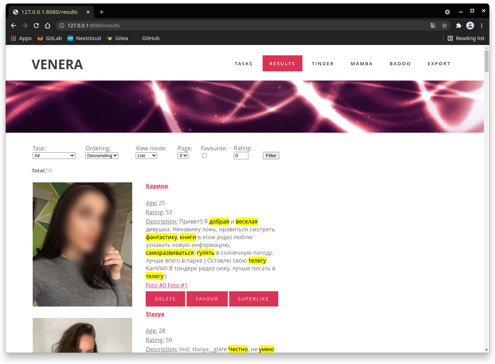
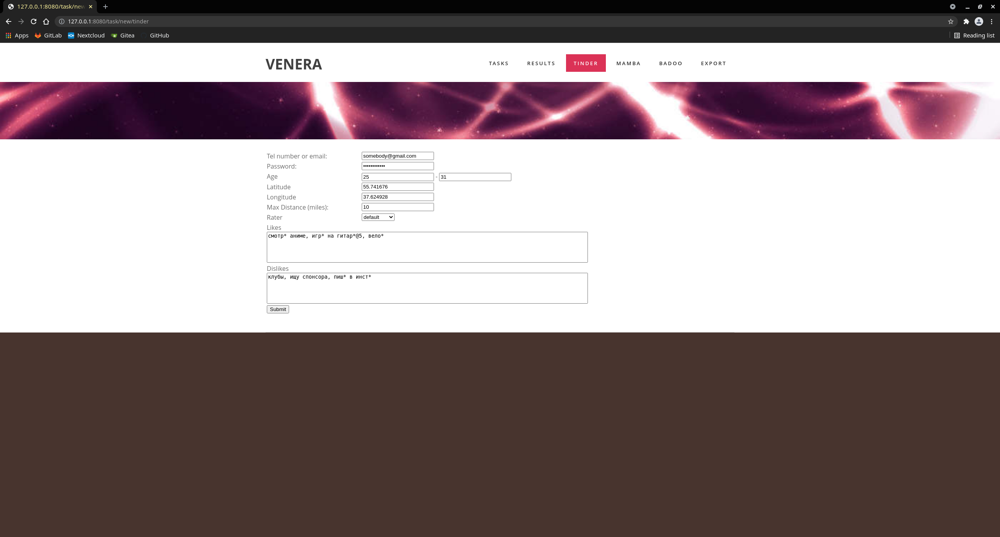

# About Venera

`venera` - is a project for search interesting girls in various dating platforms. It's developed for automate swiping and analyzing profiles.


## Features

* Web control interface;
* Can run multiple search tasks with different accounts/search settings/dating platforms;
* Implements Telegram Bot for control and notifications;
* Text analyzer for profile's description with patterns;
* Machine Learning for rate girls photos;
* A lot of tricks for avoiding ban;
* Can work as backend daemon;
* Ability of download database with photos (ex. for post-analyze or use as dataset for train neural network).

## Supported dating platforms:

* [Tinder](https://tinder.com/) (supports auth only via Google Account);
* [Mamba](https://mamba.ru/) (needs to patch fresh App ID);
* [Badoo](https://badoo.com/) **DEPRECATED**.

## Dependencies

* PostgreSQL (used as database);
* libtensorflow 1.14.0;
* google-chrome;
* libx11-xcb1, libxt6, libdbus-glib-1-2 (for Headless browser).

## Build

```shell
git clone https://github.com/racoon-devel/venera
cd venera && mkdir tensorflow
wget "http://storage.googleapis.com/tensorflow/libtensorflow/libtensorflow-cpu-linux-x86_64-1.14.0.tar.gz" && \
   tar -zxv -C `pwd`/tensorflow -f libtensorflow-cpu-linux-x86_64-1.14.0.tar.gz && \
   rm -f libtensorflow-cpu-linux-x86_64-1.14.0.tar.gz

export LD_LIBRARY_PATH=`pwd`/tensorflow/lib
export LIBRARY_PATH=`pwd`/tensorflow/lib
go build app/venera/venera.go
```

## Run

```shell
./venera -config <path to config> [-verbose]
```

### Configuration

```toml
# Sample configuration file for venera

[http]
# endpoint IP address
ip = "0.0.0.0"
# endpoint port
port = 80
# HTTP request timeout
timeout = 5
# Admin login
username = "admin"
# Admin password
password = "admin"

[database]
host = "localhost"
port = 5432
user = "venera"
password = ""
database = "venera"

[directories]
content = "/var/lib/venera"
downloads = "/var/lib/venera/downloads"

[telegram]
# Bot API token
token = ""
trustedUser = ""

# Only SOCKS5 proxy
[proxy]
enabled = false
ip = "127.0.0.1"
port = 8080
user = ""
password = ""
```

* `http` - section of HTTP server settings;
* `database` - credentials to access a database;
* `telegram` - settings of Telegram Bot:
  * `telegram.token` - [token of Telegram Bot](https://core.telegram.org/bots#3-how-do-i-create-a-bot)  
  * `telegram.trustedUser` - your Telegram user name.
* `directories` - paths to service directories;
  * `directories.content` - path to [content](https://github.com/racoon-devel/venera/tree/develop/content) directory with templates, pages, configs etc.
  * `directories.downloads` - path to directory which will be used as downloads dir for export database.

### Steps to run

1. Set `directories.content` to absolute path of content directory from this repo;
2. Set `directories.downloads` to existing directory;
3. [Create Telegram Bot Token](https://core.telegram.org/bots#3-how-do-i-create-a-bot) and set `telegram.token`;
4. Set `telegram.trustedUser` to your own Telegram username;
5. Run Venera

```shell
./venera -config <path to config> [-verbose]
```
6. Go to "http://127.0.0.1:80/". Default credentials admin:admin.

### Docker

1. [Create Telegram Bot Token](https://core.telegram.org/bots#3-how-do-i-create-a-bot) and set `telegram.token` in `configs/venera.docker.conf`;
2. Run
```shell
docker-compose up
```

## How It works ?



For each dating platform you need to set some search settings. Usually there are login, password, location and keywords. Keyword means like or dislike. It supports text patterns. Examples:

```
смотр* аниме, игр* на гитар*@5, вело* 
```

`игр* на гитар*@5` will be match with `играла на гитаре`, `играю на гитаре` etc.
`@5` - weight for keyword matching.

**Rater** - is an engine for rate user profile. It can be:

* `default` - rate profile text description only (via keywords);
* `ml` - rate only photos;
* `default+ml` - both.

Rater grade each fetched profile and put rating and all information do database. 
Tinder implementation provide Telegram notification about top profiles every day.

## Tunning

For each dating platform you can tune some weights or factors. Ex. Tinder config (`content/configuration/default.tinder.conf`):

```
MinBioLength = 50
RelevantDays = 25

VIPAccountWeight = 2
BioMatchWeight  = 2
BioPresentWeight = 5

AlcoFactor = 1
SmokeFactor = 1
BodyFactor = 1

LikeThreshold = 40
```

* `MinBioLength` - minimal length of profile text description. It means if profile description is too short, profile will be passed and ignored;
* `VIPAccountWeight` - add or remove scores if profile have Premium or Plus;
* `BioMatchWeight` - weight of matched keyword;
* `BioPresentWeight` - add scores if user profile text description filled;
* `Alco/Smoke Factor` - multiplier for bad habits( <0 - negative, 0 - ignore, >0 - positive);
* `LikeThreshold` - if person have grade >LikeThreshold, she will receive a like.

For retrain neural network you should do [this](https://github.com/joelbarmettlerUZH/auto-tinder#step-6-retrain-inceptionv3-and-write-a-classifier) and put result to `content/ml`.  